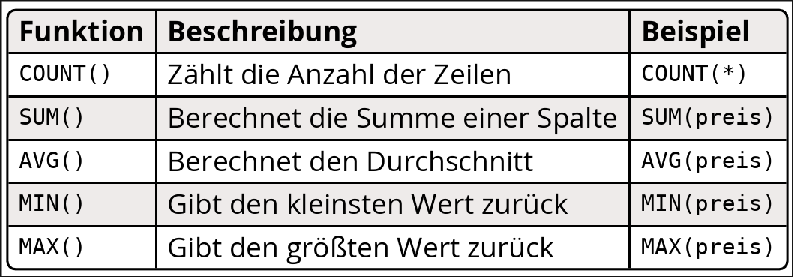
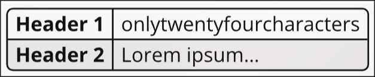
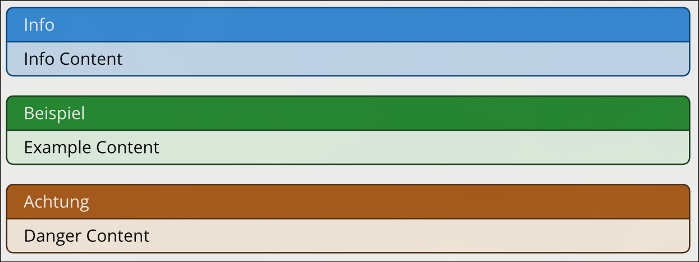

# Helper Template

Typst template package for all XAB helpers

## Usage Example

```typ
#import "template.typ": *

#show: xab-helper.with(
  "INSY",
  "3. INSY Test",
  title: "Zusammenfassung",
  doc_version: "v1.1",
)
```

> [!TIP]
> Named parameters are optional\
> `title` defaults to "Zusammenfassung"\
> `doc_version` defualts to "v1.0"

## Predefined Styles

XAB Helpers styles certain elements by default

### Tables

Table elements are styled using alternating row-colors and a subtle border radius:


> [!TIP]
> You don't manually have to make your table header bold. XAB Helper Template can do this for you:\
> Label your table with either `top-header`, `side-header` or `both-header`:
>
> ```typ
> #table(
>   columns: 2,
>   [Header 1], [onlytwentyfourcharacters],
>   [Header 2], [Lorem ipsum...],
> )<side-header>
> ```
>
> Result:\
> 

#### Remove styles

To remove predefined styles from `table` elements, label the table with `nostyle`

```typ
#table(
    columns: 2,
    [...], [...],
    [...], [...],
)<nostyle>
```

### Callouts

XAB Helper Template wraps pre-styled `showybox` callouts for different purposes:



- Info

  ```typ
  #info[
    Info Content
  ]
  ```

- Example

  ```typ
  #example[
    Example Content
  ]
  ```

- Danger

  ```typ
  #danger[
    Danger Content
  ]
  ```
